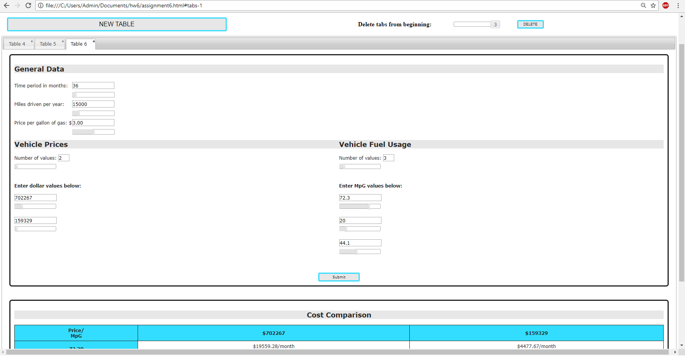

## GUI I Fall 2017 Homework #6

Extension of HW5 using jQuery UI library to make multiple tabs, each with a different instance of the comparison table interface from the previous assignments. Additionally, all input fields have a corresponding slider widget that is 2-way bound to it.

Each tab has an independent copy of the form/table layout from HW4 and HW5, and the values and output of a tab can be changed without affecting the other tabs. The validation established in HW5 is also carried over into each tab independently. Any modifications to the content of a tab will be retained in that tab until it is deleted.

Tabs can be deleted individually by clicking the 'x' icon, or in a group by setting the tab quantity slider at the top of the page and clicking the "DELETE" button. This deletes the selected number of tabs all at once, starting from the first (oldest) tab in the widget.

Example screenshot:

